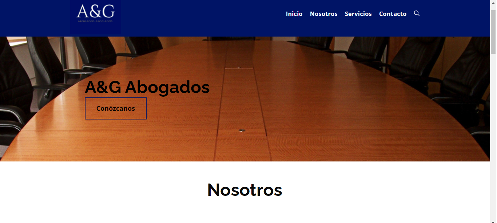

# Welcome to my personal website!

You will get to know me, some of my projects and my interests.

## About me

My name is **Felipe Gutierrez**. Actually, it's **Fabio** Felipe Gutierrez, there's some kind of tradition running in my family: since my great grandfather every _male_ born person is called Fabio, so everyone is called by their middle name. As for July 27th, 2021, I'm 27 years old and I live in Bogota, Colombia. I've completed the Foundations Curriculum and currently on Year 2 Web Stack Specialization at Holberton School.

I'm motivated by learning topics that I don't have any kind of knowledge, I always like to learn new and different things! I'm naturally a very curios person and I enjoy to investigate and to read about everything, meaning, science, technology, physics, astronomy, planes, animals.  

## Projetcs

### AYG Abogados Website




```markdown
Syntax highlighted code block

# Header 1
## Header 2
### Header 3

- Bulleted
- List

1. Numbered
2. List

**Bold** and _Italic_ and `Code` text

[Link](url) and 
```

For more details see [GitHub Flavored Markdown](https://guides.github.com/features/mastering-markdown/).

### Jekyll Themes

Your Pages site will use the layout and styles from the Jekyll theme you have selected in your [repository settings](https://github.com/ffelipegupe/personal_web/settings/pages). The name of this theme is saved in the Jekyll `_config.yml` configuration file.

### Support or Contact

Having trouble with Pages? Check out our [documentation](https://docs.github.com/categories/github-pages-basics/) or [contact support](https://support.github.com/contact) and we’ll help you sort it out.
